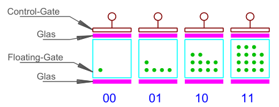

# Rechnerarchitekturen Semester 4

# Inhaltsverzeichnis

- [Rechnerarchitekturen Semester 4](#rechnerarchitekturen-semester-4)
- [Inhaltsverzeichnis](#inhaltsverzeichnis)
  - [Klausurrelevante Kapitel](#klausurrelevante-kapitel)
  - [Kapitel 1.4 Röhren](#kapitel-14-röhren)
  - [Kapitel 2.2 Klassifizierung BS](#kapitel-22-klassifizierung-bs)
  - [2.2.1 Bitbreite](#221-bitbreite)
  - [2.2.2 64-Bit-Verwechslung](#222-64-bit-verwechslung)
  - [2.2.3 NX-Bit](#223-nx-bit)
  - [2.3.4 CPU](#234-cpu)
    - [2.3.4.2 Aktueller CPU Aufbau](#2342-aktueller-cpu-aufbau)
    - [2.3.4.3 Fehlende Adressleitungen](#2343-fehlende-adressleitungen)
    - [2.3.4.4 Takt und Timing](#2344-takt-und-timing)
  - [2.3.6.2 Magnetisch](#2362-magnetisch)
  - [Kapitel 2.4 Architekturen](#kapitel-24-architekturen)
  - [2.4.1 Von-Neumann](#241-von-neumann)
  - [2.4.2 Harvard-Architektur](#242-harvard-architektur)
  - [Kapitel 2.5 PC-Bussystem](#kapitel-25-pc-bussystem)
  - [2.5.1 ISA](#251-isa)
  - [2.5.2 PCI](#252-pci)
  - [2.5.3 PCI-Express](#253-pci-express)
  - [Kapitel 3.3 Rechenwerk](#kapitel-33-rechenwerk)
  - [3.3.1 Addition](#331-addition)
    - [3.3.1.1 Halbaddierer](#3311-halbaddierer)
    - [3.3.1.2 Volladdierer](#3312-volladdierer)
    - [3.3.1.3 Paralleladdierwerk](#3313-paralleladdierwerk)
    - [3.3.1.4 Inkrement](#3314-inkrement)
  - [3.3.6 Faktor 2 hoch x](#336-faktor-2-hoch-x)
  - [3.3.7 Faktor 256 hoch x](#337-faktor-256-hoch-x)
  - [3.3.8 MAC](#338-mac)
  - [3.3.9 SIS / SIMD](#339-sis--simd)
  - [3.3.10 Sättigungsarithmetik (MMX)](#3310-sättigungsarithmetik-mmx)
- [3.4 Steuerwerk](#34-steuerwerk)
  - [3.4.4 Pipelining](#344-pipelining)
    - [3.4.4.1 Grundprinzip](#3441-grundprinzip)
    - [3.4.4.2 Superskalar](#3442-superskalar)
    - [3.4.4.3 Out Of Order Execution](#3443-out-of-order-execution)
    - [3.4.4.4 Branch Prediction](#3444-branch-prediction)
    - [3.4.4.5 Fazit](#3445-fazit)
  - [5.2.2 Dynamisch (DRAM)](#522-dynamisch-dram)
    - [5.2.2.1 Standard-DRAM](#5221-standard-dram)
    - [5.2.2.2 EDO](#5222-edo)
    - [5.2.2.3 SDR/DDR/QDR](#5223-sdrddrqdr)
  - [5.3 Nichtflüchtige Speicher (ROM)](#53-nichtflüchtige-speicher-rom)
  - [5.3.1 Allgemeines](#531-allgemeines)
    - [5.3.1.1 Maskenprogrammiert (Fuse)](#5311-maskenprogrammiert-fuse)
    - [5.3.1.2 Elektrisch Programmierbar](#5312-elektrisch-programmierbar)
  - [5.3.2 EPROM: Bezeichnung 27xxx](#532-eprom-bezeichnung-27xxx)
    - [5.3.3 EEPROM](#533-eeprom)
      - [5.3.3.2 Parallel: Bezeichnung 28xxx](#5332-parallel-bezeichnung-28xxx)
      - [5.3.3.3 Seriell](#5333-seriell)
  - [5.3.4 Flash](#534-flash)
    - [5.3.4.1 Allgemeines](#5341-allgemeines)
    - [5.3.4.2 NOR-Flash](#5342-nor-flash)
    - [5.3.4.3 NAND-Flash](#5343-nand-flash)
    - [5.3.4.4 Vergleich NAND-NOR-Flash](#5344-vergleich-nand-nor-flash)
    - [5.3.4.5 SLC MLC TLC QLC](#5345-slc-mlc-tlc-qlc)
    - [5.3.4.6 3D-NAND Flash](#5346-3d-nand-flash)
  - [5.3.5 Modernere Speicherentwicklungen](#535-modernere-speicherentwicklungen)
    - [5.3.5.1 Überblick](#5351-überblick)
    - [5.3.5.2 FRAM](#5352-fram)
    - [5.3.5.3 MRAM](#5353-mram)
    - [5.3.5.4 Fazit](#5354-fazit)
  - [5.4 Fehlerkorrektur](#54-fehlerkorrektur)
    - [5.4.1 Softerror](#541-softerror)
    - [5.4.2 Parity](#542-parity)
    - [5.4.3 ECC](#543-ecc)
  - [6.2.2 RS232/RS485/RS322](#622-rs232rs485rs322)
    - [6.2.2.1 Grundsätzliches](#6221-grundsätzliches)
    - [6.2.2 RS232](#622-rs232)
    - [6.2.2.3 RS422](#6223-rs422)
    - [6.2.2.4 RS485](#6224-rs485)
    - [6.2.8.4 USB3](#6284-usb3)
    - [6.2.9.1 Drahtgebunden](#6291-drahtgebunden)
  - [7.2.1 Leuchtdioden](#721-leuchtdioden)
    - [7.2.1.1 Einzelne Leuchtdioden](#7211-einzelne-leuchtdioden)
    - [7.2.1.2 Gruppierte Leuchtdioden](#7212-gruppierte-leuchtdioden)
  - [7.2.2 LC-Anzeigen](#722-lc-anzeigen)
    - [7.2.2.1 Grundprinzip](#7221-grundprinzip)
    - [7.2.2.2 Passive LCDs](#7222-passive-lcds)
    - [7.2.2.3 LCDs mit integrierter Ansteuerung](#7223-lcds-mit-integrierter-ansteuerung)
  - [7.3.3 DVI](#733-dvi)

## Klausurrelevante Kapitel

[1.4](#Kapitel1.4Röhren), [2.2](#Kapitel2.2KlassifizierungBS), [2.3.4](#Kapitel2.3.4CPU), [2.3.6.2](#2.3.6.2Magnetisch), [2.4](#Kapitel2.4Architekturen), [2.5](#Kapitel2.5PC-Bussystem), [3.3.1](#331-addition), [3.3.6](#336-faktor-2-hoch-x) bis [3.3.10](#3310-sättigungsarithmetik-mmx), [3.4.4](#344-pipelining),
[5.2.2](#522-dynamisch-dram), [5.3](#53-nichtflüchtige-speicher-rom), [5.4](#54-fehlerkorrektur), [6.2.2](#622-rs232rs485rs322), [6.2.8.4](#6284-usb3), 6.2.9.1, 7.2.1, 7.2.2, 7.3.3

---

## Kapitel 1.4 Röhren

Röhren: Versuch der 40er/50er Jahre, einen PC zu bauen. Bekanntes Modell der US Armee ENIAC, Verwendung von 18.000 Röhren mit einer gesamten Leistungsaufnahme von 174 kW. Jedoch unzuverlässig, da immer Röhren defekt.
GB funktionsfähige Maschine in WW2 mit 1500 Röhren, Leistungsaufnahme 4,5 kW

## Kapitel 2.2 Klassifizierung BS

## 2.2.1 Bitbreite

Bitbreite wird durch die Menge des adressierbaren Speichers entschieden.
CPU könnte theoretisch mehr adressieren, jedoch Einschränkung durch Busbreite (z.B. 32 Bit).

Gängige Systeme auf dem Markt:

- 16 Bit (max. 64 Kilobyte RAM)
- 20 Bit (max 16 Bit + Segmentierung 1 MB)
- 32 Bit (max 4 GB)
- 64 Bit (max 64 ExaByte = 18 Millionen Terrabyte)

## 2.2.2 64-Bit-Verwechslung

Jede Speicheradresse ist 64 Bit breit. Adressierung eines Datums dauert z.B. doppelt so lang gegenüber 32 Bit.
Vorteil ergibt sich erst, wenn mehr als 4 GB RAM verwendet werden.

Aktuelle Prozessoren verwenden zudem maximal 45 echte Adressleitungen, somit limitiert auf 45 Bit. Maximal anprechbarer Speicher sind damit 256 TB.

## 2.2.3 NX-Bit

*No-eXecute-Bit*

Höchsten Bits einer 64 Bit Adresse selten verwendet. Deshalb Einführung von Sonderbefehle auf Bit 63 einiger Prozessorhersteller.

Verwendeung um zu speichern, ob an Adresse Daten oder Programmcode abgelegt ist. Dient dazu es zu erschweren, dass Schadcode in Speicher eingeschleust wird.

## 2.3.4 CPU

Die CPU (Central Processing Unit) ist zentrales Element in einem Computer. 

Mittlerweile in modernen PCs unter CPU noch kleinere Mikrocontroller, die z.B. aktiv sind, bevor eigentliche CPU gestartet ist.

CPU bedient alle Busse:

- Adressbus
- Datenbus
- Steuerbus

je nachdem, welche Aktionen benötigt werden.

Interer Aufbau einer CPU normalerweise mit Registern dargestellt.

Bei alten CPUs immer bestimmtes Register bei arithmetischen oder logischen Funktionen involviert (=Akkumulator). Rechenergebnisse landen immer bei Akkumulator. Bei heutigen CPUs geschieht dies nur noch bei sspeziellen Befehlen.
Mittlerweile können mit jedem Register alle Operationen durchgeführt werden.

### 2.3.4.2 Aktueller CPU Aufbau

Langsamer Speicherzugriff auf Cache ist trotz DDR3 weiterhin Problem. Lösung durch Versuch des Einbaus nach außen eines 64 Bit Datenbusses. :arrow_right: Dadurch doppelt so schnelle Datenübertragung zwischen CPU und Hauptspeicher.

Bei modernen CPUs ab 2010 existiert Bus Struktur nur noch innerhalb der CPU. Nach außen gibt es jetzt mehrere Datenbusse und Adressbusse. Adressleitungen sind jetzt multiplexed.

### 2.3.4.3 Fehlende Adressleitungen

Besonderheit bzgl. Adressbussen ab 32-Bit:

- Speicheradressierung imkmer byteweise
- Bei 32 Bit immer gleich 4 Bytes

:arrow_right: die untersten Adressleitungen werden bei 32-Bit Prozessor nicht mehr benötigt, da immer 3 Bytes übersprungen werden

Für einzelne Adressierung der Bytes: Busleitung "Byte Enable" BE0# - BE3#
Bei 64-Bit BE0# - BE7#

### 2.3.4.4 Takt und Timing

Erste Computer genau ein Systemtakt durch Taktoszillator.
Takt in CPU von außerhalb entkoppeln.

Takt Steigerung in CPU mittels PLL umgesetzt. Speichercontroller (Cache Controller) in CPU kümmert sich um Entkopplung der unterschiedlich schnellen Busse.

Maximale Taktfrequenz bereits 2000 erreicht mit 200-300 MHz. Für schnellere Übertragung: :arrow_right: Übertragung von 4 statt einem Datenwort

## 2.3.6.2 Magnetisch
**Band**
Erste Massenspeicher waren Bänder. In Anfangszeit Zweckentfremdung von Audio-Tonspeichern.

Heutzutage immernoch bewährtes Medium zur Speicherung von Backups. 

Zugruff auf Bänder findet sequentiell statt.

- Nachteil: Zugriffsgeschwindigkeit gering, im Minutentbereich
- Vorteil: Bei Virenbefall nicht alle Daten direkt verfügbar: Verbreitung verlangsamt.

| Laufwerkstyp | Speichergröße |
| ------ | ------ |
|LTO-1 | 100 GB |
| ... | ... |
|LTO-8 | 12 TB |

**Diskette**

Zwischenlösung zwischen Magnetbandspeicher und Magnetplatte. Ähnlichkeiten mit Magnetband jedoch Vorteil des wahlfreien Zugriffs.

- Direkter Kontakt Schreiblesekopf und Medium
- starker Verschleiß und geringe Lebensdauer
- Entwicklung zu immer kleiner und höhrerer Speicherdichte

| Übliche Größe | Eingeführt | Speicher-Kapazität|
| --- | --- | --- |
| 8 Zoll | 1970er | 80 kByte bis 256 kByte |
| 5,25 Zoll | 1980er | 360 kByte bis 1,2 MByte |
| 3,5 Zoll | 1980er | 720 kByte bis 1,4 MByte |

**Platte**

Funktionsweise wie Bänder oder Disketten jedoch Schreiblesekopf schwebend über Medium. Der dadurch entstehende Luftwirbel der Rotation der Platte herrscht sorgt hierfür. Wenn Platte ausgeschaltet wird, fällt Kopf in eine Landing Zone, in der keine Daten gespeichert sind.

Vorteile:

- hohe Rotation und dadurch kurze Zugriffszeiten
- hohe Übertragungsrate

Hauptwartezeit hängt von Umdrehungsgeschwindigkeit ab, da Kopf im Mittel eine halbe Umdrehung warten muss, bis gesuchte Daten vorbei kommen.

Innenraum einer Festplatte ist mit staubfreiem Gas gefüllt. Staubpartikel würde zu Headcrash führen.

Speicherentwicklung kontinuierlich verbessert.

- Große Verbesserung durch GMR-Effekt (Giant Magneto Resistance): quantenmechanischer Effekt mit dem Zweck einen kleineren Lesekopf zu konstruieren. Ab 1995 konnte diese Technik in Platten genutzt werden.
- Weitere Steigerung 2008 durch Magnetisierung des Schreibkopfes
- 2013 SMR (Shingled Magnetic Recording) um mehr magnetische Bits auf eine Platte zu bekommen. Bei Magnetisierung eizelner Bits musste immer SIcherheitsabstand eingehalten werden. Schreibkopf ist größer als Lesekopf. Beim Lesen der nun kleineren Magnetzonen macht dies kein Problem, weil der wesentlich kleinere GMR-Lesekopf keine Probleme damit hat.

Aktuelle Festplatten speichern zwischen 2 Lücken aktuell ca. 40 MByte an Daten.

**Ausblick auf zukünftige Generationen**

Ausnutzung aller in der Vergangenheit eingeführten Technologien liefern maximale Größe von 18 TB.

- HAMR (Heat Assisted Magnetic Recording): Laser erhitzt zu schreibendes Material. Dadurch sinkt benötigte magnetische Feldstärke.
- MAMR (Microwave Assisted Magnetic Recording): direkt bei Schreibkopf Material aufgeweicht durch elektromagnetische Mikrowellenstrahlung.

## Kapitel 2.4 Architekturen

## 2.4.1 Von-Neumann

Architektur, nach der fast alle modernen PCs aufgebaut sind. Erster Computer (Zuse Z1) hatte Von-Neumann Struktur.

Prinzip: es existiert nur ein einzelnes Bussystem. Dies können Daten oder Programmcode sein.

Nachteil: Bus wird abwechselnd für Speicher und Daten verwendet. Es wird nur eine Sorte Arbeitsspeicher benötigt, der für alles zuständig ist.

Problem damals: Daten und Programmcode haben sich gegenseitig aus Cache "geworfen" (Cache-Trashing). Lösung durch Einführung von:

- Cache für Daten
- Cache für Programmcode

Vorgehen ähnelt CPU intern der [Harvard-Architektur](https://de.wikipedia.org/wiki/Harvard-Architektur)

**Nachteil der Von-Neumann Architketur:**

Software kann ihren eigenen Programmcode verändern. Schadsoftware kann dies als Möglichkeit der Ausbreitung nutzen.

## 2.4.2 Harvard-Architektur

Entwicklung durch IBM und Harvard-Universität 1944.

**Wichtigstes Merkmal:**

Physikalisch getrennte Speicher und Busse für Programmcode und Daten.

Dadruch 2 Vorteile:

- Zugriff auf Speicher bei Befehlsabarbeitung doppelt so schnell
- Nahezu unmöglich, dass Programm eigenen Code überschreibt.

Programmspeicher ist bei normaler Ausführung Nur-Lese-Speicher. Bei Embedded Systemen oft sogar in ROM-Speicher abgelegt.

Modifizierte Version (Modified-Harvard) z.B. als Cache in modernen Systemen implementiert.

## Kapitel 2.5 PC-Bussystem

## 2.5.1 ISA

Erster Standard Bus für PCs war der von IBM in den 1980ern entwickelte ISA-Bus (Industry Standard Architecture). Vorerst als XT-Bus mit 8-Bit-Datenbusbreite und 4,7 MHz. Wenig später 18 Bit mit 8,33 MHz.

Der gesamte Systembus wird direkt auf den ISA-Stecker geführt. Spätere Entwicklung ISA-BUS mit 32 Bit hat sich nicht durchgesetzt.

Für Industrieanwendungen werden noch ISA-Slot-Systeme verwendet (Altlasten) durch ISA-Hardware-Emulation.

## 2.5.2 PCI

Einführung PCI-Bus (Peripheral Component Interconnect) Mitte 90er Jahre. BUS hat keine direkte Verbindung mehr zu CPU. Verbindung stattdessen über Chipsatz des Prozessors.

PCI-Bus trennt Daten und Adressleitungen nicht, sondern Multiplexing. Adresse und Daten haben beide 32-Bit, Taltfrequenz 33 MHz. Übertragungsrate im [Burst-Modus](https://de.wikipedia.org/wiki/Burst-Modus_(Daten%C3%BCbertragung)) maximal 133 Mbyte/s.

Später Entwicklung einer 64-Bit-Variante (PCI-X) mit Stecker doppelter Größe, hauptsächlich für Serverbetrieb, jedoch kein Erfolg auf dem Markt.

## 2.5.3 PCI-Express

Bei Entwicklung paralleler Bussysteme entsteht Problem, dass alle Signale auf allen Leitungen zwischen allen Komponenten gleich lang unterwegs sein müssen. Abhilfe durch künstliche Verlängerung von Leiterbahnen mittels Mäander (Schlaufen zur künstlichen Verlängerung).

Diese Methode begrenzt jedoch Datendurchsatz. Steigerung nur möglich durch Aufgabe des parallelen Datendurchsatzes zu seriellem Durchsatz.

PCIe (ca. ab 2003) Ersetzung des Busses durch serielle Punkt zu Punkt Verbindung (Lane). 

Taktfrequent bei PCIe-1 2,5 GHz, Verdopplung der Übertragungsrate von 32-Bit-PCI.

Zusammenschalten von bis zu 16 Lanes um noch mehr Daten gleichzeitig zu übertragen. Die so übertragenen Daten treffen nicht gleichzeitig an Ziel ein uns müssen wieder korrekt Zusammengesetzt werden.

PCIe ist für Software nicht sichtbar, da die parallel-seriell-parellel Wandlung direkt von Hardware übernommen wird.

## Kapitel 3.3 Rechenwerk
## 3.3.1 Addition
### 3.3.1.1 Halbaddierer

Aufgabe ist Addition von einstelligen Dualzahlen

Wahrheitstabelle

| a | b | s | c | 
| --- | --- | --- | --- |
| 0 | 0 | 0 | 0 |
| 0 | 1 | 1 | 0 | 
| 1 | 0 | 1 | 0 | 
| 1 | 1 | 0 | 1 | 

Formel für S:  s = (not a and b) or (a and not b)
Formel für C:  c = a or b

### 3.3.1.2 Volladdierer

***Gatter Symbol***

### 3.3.1.3 Paralleladdierwerk

Kompletzte Addition zweier Register:

- Sumanden in Registern mit der Breite N
- Steuersignal in Addition aktiviert das Paralleladdierwerk
- Mit nächster Taktflanke wird Ergebnis dann is das A-Register übernommen

Für eine Subtraktion, wird bei Subntrahent (B-Register) noch ein Zweierkomplement zwischengeschaltet

*Ripple Carry*
Addition mehrstelliger Zahlen, wird pro Dualstelle ein Volladdierer benötigt

*Carry Look Ahead*

### 3.3.1.4 Inkrement

Inkrementierung ist eine sehr häufig benötigte arithmetische Funktion.

- Bei Schleifenberechnung ist das Inkrementieren der Zählervariable eine typische Aktion

Wenn nur um 1 inkrementiert wird, kann jeder Volladdierer durch einen Halbaddierer ersetzt werden, außer der des Least Significant Bit (LSB).

## 3.3.6 Faktor 2 hoch x

Division oder Multiplikation mit dem Faktor $2^x$

- Entspricht Shift-Operation um 1 Bit

Viele COmpiler erkennen diese Funktion und setzen $2^x$ damit automatisch durch SHift-Befehl um. Dauer üblicherweise nur 1 Taktzyklus

## 3.3.7 Faktor 256 hoch x

Fast alle modernen Compiler führen in diesem Fall keine Operation aus

:arrow_right: Adresszugriff der multiplizierenden variable um 1 Byte

## 3.3.8 MAC

Für Berechnung von Fourir-Transformation
$$
z=z+(x \cdot y)
$$

MAC-Einheit (Multiply ACcumulate)

- Multiplikation ist oft breiter
als die Ergebnisbreite des Multipliers
- Die Eingangswerte $x,y$ des Multipliers können bei den meisten Signalprozessoren mit automatischem Zeiger auf nächsten Multiplikator weitergeschaltet werden.

## 3.3.9 SIS / SIMD

Normal kann in einem Register der CPU nur eine Operation auf den gesamten Registerinhalt angewandt werden SISD (Single Instruction Single Data). 
- Bei 16-Bit-Operationen 75% des 64-Bit-Registers ungenutzt
- Um Registerbreite voll zu nutzen:  (Single Instruction Multiple Data): Register in mehrere Teilte geteilt, EInzelteile werden wie separate Register behandelt
- Bei 64-Bit bis zu 8x 8-Bit Berechnung

## 3.3.10 Sättigungsarithmetik (MMX)

MMX :arrow_right: (Matrix Math Extensions oder Multi Media
Extensions)
Zuständig für Verschnellerung von Signalverarbeitungen

- Verhinderung mögliches Über-/unterlaufs
- Ergebnis bleibt auf dem Größt-/Kleinstmöglichen Registerwert stehen

Fallbeispiel 8-Bit-Sättigungssarithmetik
|||
| --- | --- |
| ohne Sättigung | $187+175=106+$Carry-Bit$=106+256=362$ |
| mit Sättigung | $187+175=255$|

# 3.4 Steuerwerk

## 3.4.4 Pipelining

### 3.4.4.1 Grundprinzip

Prozessoren in unterschiedliche Verarbeitungsklassen unterteilen

- nicht skalar :arrow_right: weniger als 1 Assemblerbefehl pro Taktzyklus
- skalar :arrow_right: 1 Assemblerbefehl pro Taktzyklus
- superskalar :arrow_right: mehr als 1 Assemblerbefehl pro Taktzyklus

Bei jedem Takt ein neuer Befehl

### 3.4.4.2 Superskalar

Weiterer Entwicklungsschritt: Gesamte Pipeline kann doppelt ausgeführt werden.

Verwendung mehrerer Pipelines und Execution Units

(bei Intel ab 1993 mit dem Pentium :arrow_right: U
und V-Pipe)

### 3.4.4.3 Out Of Order Execution

Gewisse Befehlsabfolgen lassen sich schlecht mit einer oder mehreren Pipelines parallel verarbeiten
Lösung :arrow_right: Vertauschen von Befehlsreihenfolgen :arrow_right: bessere Ausnutzung von Pipelines

Befehle werden in Warteschlange (Instruction Buffer) eingereiht. Befehlsdecoder prüft mit Heuristik, ob Befehl vorgezogen werden kann, wenn Execution Unit frei ist

Nach Ausführung werden Ergebnisse in Re-order-Buffer eingereiht und in Ursprungs-Reihenfolge zurück an Speicher oder Ergebnisregister übergeben.

### 3.4.4.4 Branch Prediction

Zur Optimierung von urspr. Programmcode :arrow_right: in modernen Prozessoren weitere EInheit: Sprungvorhersage-Einheit (Branch-Protetction-Unit)

- in Zusammenarbeit mit der Out-Of-Order-Unit Vorhersage für wahrscheinlichsten Zweig
- Bei Vorhersage Ausführung von spekulativem Code. Bei Fehler muss er wieder verworfen werden
- Sehr aufwändige Technologie :arrow_right: Verbrauch von viel Energie

### 3.4.4.5 Fazit

Zusammenspiel von:

- mehrfachen Pipelines
- mehrfachen pipelineübergreifenden Execution-Units
- Out-Of-Order-Execution
- Branch-Prediction-Unit
- Speculative Execution

sorgt für Performance Steigerung

Alle Optimierungen Zusammen bilden Sicherheitslücke (Stichwörter: Spectre, Meltdown).

## 5.2.2 Dynamisch (DRAM)

### 5.2.2.1 Standard-DRAM

DRAM-Speicher (Dynamic Random Access Management) basiert auf einem kleinen Kondensator, in dem Bit Wert mittels elektrischer Ladung gespeichert wird.

- Vorteil: nur ein Transistor zur Bit Speicherung nötig

- Größe heutzutage im Gigabit Bereich
- Kondensator entlädt sich von selbst
- Vor jedem Verlorengehen muss Inhalt ausgelesen werden
- Zyklisches Auslesen im Refresh Zyklus

Darstellung des DRAM-Speichers in einem 2-Dimensionalen Array

- Wortleitungen
- Bit-Leitungen

Zugriff auf Kondensator erfolgt über:

- RAS (Row-Adress-Select, Zeilenadresse)
- CAS (Column-Adress-Select, Spaltenadresse) unterteilt

:arrow_right: Zugriffdauer heutzutage im Bereich 40-60 nS mit Zugriffstaktfrequenz von 16-15 MHz

Wen nur ein Adressteil verwendet wird :arrow_right: Zugriff doppelt so schnell

RAM-Module

- Parallelschaltung der Adressierungseingänge werden bei mehreren DRAM-Bausteinen eingesetzt
- Für jedes Bit des RAM-Moduls war eigener Baustein zuständig

Heutzutage 4-Bit

Parallelschaltung

- Führt bei manchen Rechner-Designs zu einer Überlastung des Adressbusses
  - Kann verhindert werden, indem vor Adressleitungen der Bausteine auf RAM-Modul ein zusätzlicher Buffer geschaltet wird :arrow_right: Bufferd-RAM
  - Wenn zusätzlich noch Zwischenspeicher (Latch) für Adresse vorgeschalten wird, spricht man von Registered-Ram

### 5.2.2.2 EDO

- Addressierungsphase dauert gewisse Zeit
- Bis nach Abschluss dieser Phase sind Daten auf dem Adressbus ungültig

- Diese Wartezeit kann anderweitig genutzt werden:
  - Einführung eines extra Buffers in die Datenausgänge der RAM-Bausteine (Enhanced Dynamic Output
- Während Adressierungsphase ist in Datenbuffer noch das vorherige Datenwort gespeichert und liegt auf Datenbus
  - :arrow_right: Verschachtelter Adressierung möglich

Nachteil von EDO-RAM:

- Asynchrone Arbeitsweise
- Zeiten zwischen den RAS und CAS nicht gleichmäßig, jeder RAM-Baustein ist anders
  - :arrow_right: der langsamste Baustein bestimmt Schreib-/Leserate
  - Einbeziehung von Sicherheitsreserve für Schwankunen durch z.B. Temperaturunterschiede

### 5.2.2.3 SDR/DDR/QDR

**SDR**

- Einführung eines gemeinsamen Takts für gesamten RAM-Baustein
  - Alle Steuersignale beziehen sich auf Taktsignal

Prozessoren schreiben/lesen durch zwischengeschalteten Chache Speicher im Burst Mode

- Lesen von immer 16 Bytes hintereinander

Speicherbausteine wurden insofern optimiert, dass Speicherzugriffe auf aufeinanderfolgende Adressen schnell stattfinden

Durch:
- Pipelining
- Vervielfachungder Speicherbänke
- mehrere Buffer innerhalb des RAM-Bausteins

Verdopplung Geschwindigkeit gegenüber EDO-RAM

**DDR/QDR**

Synchrone Ausgabe von SDRAM schnell wieder zu langsam.
Deshalb:

- Pro Taktperiode Ausgabe von 2x Datenworten statt 1x :arrow_right: DDR (Double Data Rate)

| Standard | Zugriffe |
| --- | --- |
| DDR2 | 2 Zugriffe |
| DDR3 | 3 Zugriffe |
| DDR4 | 4 Zugriffe |

:arrow_right: Daten im Voraus bereithalten (Prefetch) 
QDR-SDRAM (Quad Data Rate Synchronous Dynamic
Random Access Memory)

**5.2.2.4 Fazit**

Zugriffszeit des ersten wahlfreien Zugriffs heute immer noch 40-60 nS. Maximale Zugriffstaktfrequenz 16-25 MHz.

:arrow_right: Problem umgehen durch Einführen eines schnellern Cache Speichers zwischen RAM und CPU

## 5.3 Nichtflüchtige Speicher (ROM)

## 5.3.1 Allgemeines

### 5.3.1.1 Maskenprogrammiert (Fuse)

Speicherbausteine erster Computer war ROM (Read-Only-Memory), mittlerweile fast ausgestorben
:arrow_right: Vorteil durch schnelle Zugriffszeit

### 5.3.1.2 Elektrisch Programmierbar

- Information eines Bits wird in Floating Gate eines Feldeffekttransistors gespeichert
  - mittels Glas-Elektroden vom Rest isoliert und elektrisch nicht angeschlossen

**Schreiben**

- Anlegen einer höheren Spannung (ca. 12-25 V) an Control-Gate und den Drain
- Source liegt auf 0 V
  - :arrow_right: Transistor wird leitend und hoher Strom fließt zwischen Source und Drain
  - Elektronen wandern mittels quantenmechanischem Tunneleffekt durch untere 50nm Glas-Elektrode auf Floating Gate
  - Bis Abschalten der Spannung bleiben sie dort

**Lesen 0**

- Lesevorgang ebenfalls über Control-Gate
- Jedoch kleinere Spannung als beim Schreiben
- Wenn Transistor ungeladen ist (0), verhält sich Floating-Gate anders als bei geladenem
  - Wie normaler MOSFET :arrow_right: Durchsteuerung und an Ausgang und Leseverstärker liegen 0 V

**Lesen 1**

- Durch geladenes Floating-Gate (1) wird Durchsteuern verhindert
- Transistor ist gesperrt: :arrow_right:
  - Ausgang und Leseverstärker 3 V

## 5.3.2 EPROM: Bezeichnung 27xxx

Nichtflüchtiger löschbarer Speicher: (Erasable Programmable Read Only Memory)

- Löschen nach Beschreibung mittels UV-Licht
  - Dauer ~20min. Nur 100 mal möglich da Kristallstruktur durch UV- Strahlung zerstört wird
- Quarzglas-Fenster eingebaut, damit UV-Licht durchdringend kann: Wellenlänge 254nm.
  - Restliches Gehäuse aus Keramik gefertigt
- Löschen mittel Photoeffekt

EPROM Werte:

- Datenbusbreite 8-Bit
- Größen zwischen 64 kBit und 8Mbit

### 5.3.3 EEPROM

Nichtflüchtiger elektrisch löschbarer Speicher: (Electrically Erasable Programmable Read Only Memory)

- Erzeugung der Spannung für Schreibvorgang intern
- Verschiedene Verfahren zum Löschen der Daten
  - größere negative Spannung an COntrol-Gate anlegen
  - oder positive Spannung am Dran Anschluss
  - oder MOSFET

#### 5.3.3.2 Parallel: Bezeichnung 28xxx

Ersatz für EPROMS da Pinkompatibel.

- Löschung einzeln oder durch Blöcke möglich
- Ausgestorben :arrow_right: durch Flash-Bausteine ersetzt

#### 5.3.3.3 Seriell

Heute oft in Embedded-Systemen verwendet

- Löschung fast jeder Speicherzellen einzeln möglich: mehrere 10.000 mal möglich
- Dauer von Speichern inkl. Löschung im Millisekunden Bereich
- 8-Polige Bauform

Nutzung z.B. auf DRAM-Moduk als Speicher für Referrnzdaten (Versorgungsspannung, Speicherkapazität, Timing, Refresh-Daten)

## 5.3.4 Flash

### 5.3.4.1 Allgemeines

Bit SPeicherung ebenfalls in Floating-Gate von Feldeffektransistor gespeichert.

Unterscheidung in NOR-Flash und NAND-Flash

### 5.3.4.2 NOR-Flash

Ausführung der einzelnen Zellen als Matrix mit wahlfreiem Zugriff

- Zugriff überr Adress-Wortleitung

### 5.3.4.3 NAND-Flash

Hintereinanderschlatung von Gruppen von Zellen.

- Bei Zugriff auf einzelen Zelle müssen alle Nachbarzellen in Kette durchgesteuert werden
- Wegen Signalübertragung durch Nachbartransistoren weniger zuverlässig als NOR-Flash
- Haltbarkeit gegenüber NOR-Flash 1/10

### 5.3.4.4 Vergleich NAND-NOR-Flash

| Eigenschaft | NOR | NAND |
| --- | --- | --- |
| wahlfreier Zugriff | ja | nein |
| Löschgeschwindigkeit | langsam | schnell |
| Fläche/Zelle | groß | klein |
| Zuverlässigkeit | hoch | niedrig |
| Verwendung | Programmspeicher in Mikrocontrollern | USB-Sticks, Speicherkarten, Festplatten |

### 5.3.4.5 SLC MLC TLC QLC

Für Speicherung von mehr Informationen pro Fläche, Entwicklung, mehr als eine 1 Bit information in Flash-Zelle zu speichern

- Menge der in das Floating-Gate fließenden Elektronen über zeit oder angelegte Spannung gesteuert
  - 3 Füllstufen: Speicherung von 2 Bit in Zelle

MLC-Zelle

Mit 7 Füllstufen Speicherung von 3-Bit

Beim Auslesen muss eine Trennung der Füllstufen ermittelt werden.
Schon ab TLC Fehlerkorrektur aufwändig
- Je mehr Füllstufen, desto weniger Löschzyklen

### 5.3.4.6 3D-NAND Flash

Speicherung an Grenzen gekommen, Elektronen können nicht ohne Fehlererzeugung weiter verringert werden

- Möglichkeit der Aufeinanderstaplung in der 3. Dimension
- Floating Gate aus Siliziumnitrid jetzt Charge Trap
- Damit ELektronen nicht driften, einbauen von Hürden

## 5.3.5 Modernere Speicherentwicklungen

### 5.3.5.1 Überblick

Moderne nicht-flüchtige SPeicher sind deutlich schneller als FLASH oder EEPRONs.

- Information wird im Gegensatz zu FLASH oder EEPROM nicht in elekrtrischem Feld, sondern mittels ferroelektrischer Materialien in Magnetfeld gespeichert
- Robust  $10^{10}$ Schreib-Lese-Zyklen

### 5.3.5.2 FRAM

FRAM-Speicherzellen (Ferroelectric Random Access Memory, auch FeRAM)

- physikalisch ähnlich wie Feldeffekttransistor mit Floating-Gate
- Speicher- und Löschvorgang ebenfalls durch Polarisationsänderung umgesetzt (ferroelektrische Schicht)

### 5.3.5.3 MRAM

MRAM-Speicherbausteine (Magnetoresistive Random Access Memory)

- Ähnlichkeiten zu GMR-Effekt
- Phsyikalisch ähnlich zu Feldeffekttransistor mit Floating-Gate
- unempfindlich gegenüber elektromagnetischer Strahlung
  - :arrow_right: Luft und Raumfahrt
  - 50x teurer als FLASH Speicher

### 5.3.5.4 Fazit

- Vermehrte Weiterentwicklung FRAM MRAM
  - Speicherdichte geringer als FLASH und DRAM
  - Schwierigkeit in der Integration ferroelektrischer Materialien in konventionelle Chip-Produktion

## 5.4 Fehlerkorrektur

### 5.4.1 Softerror

In Anfangszeit der Speicherbausteine istz es häufig vorgekommen, dass einzelne Bits ihren Wert von alleine geändert haben

- Ursache energiereiche Strahlung radioaktiver Isotope in Gehäusematerialien
- Gehäuse damals viel größer als heute, da viele Bausteine auf Leiterplatte benötigt wurden

Diese Softerrors wurden mit der Zeit immer weniger da:

- Vergussmaterialien immer ebsser wurden
- immer weniger Matieral verbaut wurde, das radioaktive Isotope enthält
- Thema heute wieder relevanter, aufgrund der vielen Gigabyte an Speicher, die verbaut werden

### 5.4.2 Parity

Beeinflussung der Softerrors, erste Maßnahme einfache Paritätsprüfung.
Für Gruppe von 8-Bit wurde ein 9. Bit als Paritary-Bit eingeführt.

Bei ungerader Anzahl an Bits: Parity-Bit: 0
Bei gerader Anzahl an Bits: Parity-Bit: 1

Nachteil: bei Umkippen von 2 Bits in einem Datenwort stimmt Paritäts-Prüfung nicht mehr

### 5.4.3 ECC

Weiterentwicklung von Paritätsprüfung EEC (Error Correction Code) Prüfung.

Prüfung von umgedrehten Bits in 2-Dimensionalem Array.
Dadurch eine doppelte Kontrolle möglich.

## 6.2.2 RS232/RS485/RS322

### 6.2.2.1 Grundsätzliches

RS232 (Recommendes Standard 232) ist ein Übertragungsstandard der 1960er Jahre. 

Nutzung nur noch in Mikrocontroller-Programmierung und Industriebereich.

### 6.2.2 RS232

- Asynchrone, serielle, full duplex Verbindung in Negativ-Logik
- Übertragung mittels Spannungspegel

- Logische 1 = 0 V
- Logische 0 = 3 V

Häufige Nutzung mit modifiziertem Pegel :arrow_right: RS232-TTL. Umwandlung zwischen RS232 und RS232-TTL mit Baustein MAX232 möglich.

*Bezeichnungen*

Wichtigste 4 Leitungen

| Abkürzung | Bedeutung |
| --- | --- |
| TX | Sendeleitung |
| RX | Empfangsleitung |
| RTS | Bereit zum Senden |
| CTS | Bereit zum Empfangen |

Heute hat RS232 Schnittstelle 9 Leitungen. Mindestens notwendig sind 2: (TX/RX)

Bei Verbindung muss festgelegt werden, wie lang (zeitlich) der Abstand zwischen 2 gesendeten Bits sein soll :arrow_right: Baud-Rates

| Bit/Sekunde | Max. Leitungslänge in Meter |
| --- | --- |
| 2400 | 900 |
| 4800 | 300 |
| 9600 | 150 |
| 19200 | 15 |
| 57600 | 5 | 
| 11520 | <2 |

*UART*
Baustein zwischen CPU und eigentlicher Schnittstelle. 
UART (Universal Asynchronous Receiver Transmitter). übernimmt die parallel-seriell-Wandlung (in Mikrocontrollern häufig mit integriert).

*Handshake*
Damit keine Daten bei Übertragung verloren gehen.

- Software-Handshake
  - Empfänger sendet Xon jnd Xoff Zeichen um Sender anzuhalten oder wieder fortsetzen zu lassen
- Hardware-Handshake
  - Über RTS und CTS Übertragung angelhalten und dann wieder fortgesetzt.

### 6.2.2.3 RS422

Weiterentwicklung der RS232 Schnittstelle und benutzt dasselbe Bitmuster. Signale werden Vollduplex und symmetrisch mit 2 Leitungen pro Richtung.

- 1 Sender kann 10 Empfänger zusammenschalten

- Typischerweise bei +-5 V
- Bereich zwischen 0,2 V und -0,2 V nicht definiert
- Max. Leitungslänge 1200m
- Max. Übertragungsrate 10 MBit/s
  - (nicht gleichzeitig möglich)
- Ab 200 kBit/s Abschlusswiderstand notwendig

Qualität der Kabel hat großen EInfluss auf max. Kabellänge und Übertragungsrate.

- Vorteil durch Verdrillung der beiden sym. Adern (Twisted Pair)

### 6.2.2.4 RS485

*Grundsätzliches*

Überführung der RS422 Schnittstelle in Halbduplex. Zusammenschaltung von bis zu 32 Geräten.

- Es existieren Treiberbausteine mit erhöhter Leistung für bis zu 256 Geräte
- Wegen Halbduplex muss Sendeverstärker jedes Geräts abgeschalten werden.

*Bezugsleitung*

- umgekehrte gegenpasige Polarität: GND-Bezugsleitung kein Stromfluss
- Geräte erhalten Bezugspotential über das Erdpotential
  - -7 bis +12 V erlaubt
  - Bei großen Leitungslängen sollte Bezugspotential mitgeführt werden, sonst evtl. Störung

*Busabschluss*

Da Sender jetzt abschaltbar sind, Möglichkeit, dass kein Sender am Bus aktiv ist.

- Wenn kein Sender aktiv ist und nur $120 \Omega$-Widers-tand genutzt ist, lann der Leitungspegel auf undefinierten Zustand von 0 V fallen.
- Evtl. Schwungung dadurch und senden zufälliger Signale
- Lösung Failsafe Busabschluss

*Neuere Versionen*
- Bei neueren RS485 Bausteinen Verzicht auf Negativ-Komponente
- Signale nur noch zwischen +5V und 0 V
- Vereinfachung des Designs
- Erzeugung negativer Hilfsspannungen fällt weg

### 6.2.8.4 USB3

*USB 3.0*

- Erhöhung der Geschwindigkeit
- Steckertyp auf mehr Daten-Leitungen erweitern
- Rückwärts- und Vorwärtskompatibilität erhalten
- 5 zusätzliche Leitungen als 2 differenzielle-fullduplex-Paare 
- extra Massenpin

| Pin | Name |Beschreibung |
| --- | --- | --- |
| 1 | VBUS | +5V |
| 2 | D+ | differnetielles Paar 1+ |
| 3 | D- | differentielles Paar 1- |
| 4 | Masse | 0V |
| 5 | SSTX- / SSRX- | differentielles Paar 2- TxRx |
| 6 | SSTX+ / SSRX+ | differentielles Paar 2+ TxRx |
| 7 | Masse | Masse für differentielles Paar 2 |
| 8 | SSTX- / SSRX- | differentielles Paar 2- TxRx |
| 9 | SSTX+ / SSRX+ | differentielles Paar 2+ TxRx |

:arrow_right: bis zu 5GBit/s durch FUllduplex und Bitcodierung auf der Leitung

- Kennzeichnung USB3-Stecker blaue Buchse
- statt 0,5 A jetzt 0,9 A
- 4,5 Watt bei weiterhin 5 V
- max Kabellänge 3m

*USB3.1 / USB3.2*

- neue große Änderunge neuer Steckertyp: USB Typ-C
- Einsteckung in beide Richtungen
- 4 Halbduplex SuperSpeed-Leitungspaare

Neuerungen:

- symmetrischer Stecker
- 24 Leitungen
- effizientere Codierung
- höhere Spannung
- verschiedene Spannungen möglich
- Leistung bis 100W

Technische Daten:

- Übertragung bis 10GBit/s
- Spannungen 5 V, 12 V, 20 V
- Strom bis 5 A
- Leistung max. 100 W
- Max. Kabellänge bei USB 3.1 1m

Bei USB 3.2 Ausnutzung zusätzlicher Leitungen Kabel bis zu 20 GBit/s

### 6.2.9.1 Drahtgebunden

*Allgemeines*

- Physikalisch immer serielle
- bei parallelen Verbindungen würden bei langen Leitungen Laufzeit-Probleme auftreten (wie Busleitungen in Computern)
- Ethernet gängiger Standard

*Koaxial*

- Nur zuverlässig wenn weniger als 10 Teilnehmer verbunden waren
  - wegen gleichem Übertragungsmedium
  - oft Kollisionen bei gleichzeitigem Senden
- Max 10 MBit/s
- Max Leitungslänge zwischen 2 Teilnehmern 185m
- Signapegel bei Manchester-Codierung zwischen 0 und -2.2 V

*Twisted Pair 2x2*

- Übertragung +-2.5 V
- symmetrisch
- full-duplex
- 1 Adernpaar pro Richtung
- CAT5 Kabel 100MBit/s

*Twisted Pair 4x2*

- Übertragung 4GBit/s
- 4 Adernpaare genutzt
- Fullduplex
- Übertragung auf allen Aderpaaren gleichzeitig in beide Richtungen
- Echokompensation an beiden Kabelenden

*ix Industrial*

*Twisted Pair 1x2*

- Industrie Bereich
- nur noch 1 Adernpaar (SIngle Pair Ethernet)
- CAT7 bis 1 GBit/s
- max. Kabellänge 15-40m
- 1000m mit niedrigen Datenraten (10 MBit/s)
- PoE möglich
  - Power over Data Line (PoDL)
  - 12-48 V mit 0.5-50 W

*Glasfaser*

- Übertragung über optische Glasfasern
- erst ab 1 GBit/s sinnvoll wegen teuer Technik
- Kurze Entfernungen (einige 100m) Multimodeglasfaser
- Lange Entfernungen (einige KM) Monomode Glasfaser
- Faser Dicke μm-Bereich bei ca. 100-200 μm

- Licht im Infrarotbereich
  - 850 nm-1550 nm
- Fullduplex Übertragung
- Eine Faser pro Richtung

Monomode Übertragung nahezu perfekt. Multimode verbreitert und verschleift Eingangsimpuls (Dispersion)

- Umwandlung von Kupfer auf Glasfaser mittels Medienkonverter (1 GBit/s)
- Ab 10 GBit/s Transceiver Module direkt in Netzwerkport

*TOSLINK*

- Consumer Audiotechnik
- Keine Glasfaserübertragung
- Rotes Licht ca 650 nm über Kunststofflichtwellenleiter übertragen
- Übertragung unter 10 MBit/s
- Elektromagnetische Störbeinflussung gering

## 7.2.1 Leuchtdioden

### 7.2.1.1 Einzelne Leuchtdioden

Ansteuerung einer Leuchtdiode mittels Port-Pin

- Möglichkeit Hig
- Low-aktiv

Digitalausgänge können bei Low-Pegel mehr Strom aufnehmen als sie bei High-Pegel iefern können. :arrow_right: Low-aktiv Version besser

LEDs mit unterschiedlichen Farben:

- Beachtung der Durchlassungsspannung
- Blaue LEDs über 3 V
  - bei Controllern mit nur 3 V Versorgungsspannung damit nicht geeignet
- Grüne LEDs gleiches Verhalten wie blau
- in weißen LEDs sind immer blaue LED-Chips enthalten

### 7.2.1.2 Gruppierte Leuchtdioden

*Einfache Matrix*
Falls eine größere Zahl LEDs einzusteuern ist:

- multiplexed Matrix
- LEDs immer nur kurze Zeit angeschaltet
- Für Helligkeit muss Strom kurzzeitig sehr hoch sein
  - Einige Ampere kurzzeitig

*7-Segment*

Varianten:

- Gemeinsame Kathode
- Gemeinsame Anode

Durch gemeinsamen Anschluss kann 8-facher Strom fließen.
Deswegen Ausgangspins des anzusteuernden ICs mit Transistoren verstärken

- Variante gemeinsame Anode besser geeignet. Ausgangspins von Mikrocontrollern i.d.R stark genug um Kathoden der LEDs ohne Transistor direkt anzusteuern

## 7.2.2 LC-Anzeigen

### 7.2.2.1 Grundprinzip

LCD (Liquid Crystal Display) basiert auf Flüssigkristallen die Polarisationsrichtung von Licht beeinflussen.

- Bei Polarisation geht 50% verloren
- Flüssigkristalle zwischen 2 Glasscheiben eingebettet
- Anlegung auf einer Scheibe senkrecht, andere Waagrecht
  - Übergang dazwischen Schraubenförmig
- Bei Spannung Anlegen (Pixel=Aus) :arrow_right: schraubenförmige Anordnung zerstört

Farbdarstellung:

- Farbfilter zwischen Polfilter und Flüssigkristallzelle
- Wirkungsgrad fällt um 2/3
- Neue Modelle setzen statt weißem blaues Licht als Hintergrundbeleuchtung ein 
  - konvertieren grün und rot über Fluoreszenzstoffe oder Quantenpunkten (QLED)
    - Besserer Wirkungsgrad und verbesserte Farbdarstellung

### 7.2.2.2 Passive LCDs

- normal keine Farbdarstellung
- Stufen nur Ein/Aus
- preisgünstig
- Ansteuerung einfach

Bei einfachen 4-Stelligen Standarddisplays hat jedes Segment extra Pin

- Keine dauerhafte Gleichspannung anlegen, sonst Zerstörung der Flüssigkristalle
  - Pulsierende Gleichspannung mit max. 1 kHz an Backplane anlegen und an Ein-Segmente invertierte Spannung

### 7.2.2.3 LCDs mit integrierter Ansteuerung

Controller hat 4-Bit Modus, für Ansteuerung nur 7 Leitungen beötigt.

- An Kontrastleitung muss echte einstellbare negative Spannung angelegt werden
- Erzeugun dieser über Ladungspumpe
- LCD Module nutzen fast alle SPI-Schnittstelle

## 7.3.3 DVI

DVI Schnittstelle (Digital Visual Interface)

- digitale Schnittstelle
- Übertragung mittels synchroner, symmetrischer Übertragung
- 6 einzelne differenzielle Signale
- Kabel bis zu 10m
- Synchrones Clock-Signal ebenfalls über Kabel
- Für Rückwärtskompatibilität 4 analoge Signale (RGB+H-Sync) über Stecker übertragen

Typen:

- DVI-D nur digitale Leitungen genutzt
- DVI-A nur analoge Leitungen genutzt
- DVI-I digitale und Analoge genutzt

Übertragung ausschließlich gleichanteilsfrei :arrow_right: Übetragung gleicher Anzahl an 0 und 1.