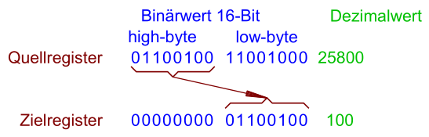

# Rechnerarchitekturen Semester 4

# Inhaltsverzeichnis

- [Rechnerarchitekturen Semester 4](#rechnerarchitekturen-semester-4)
- [Inhaltsverzeichnis](#inhaltsverzeichnis)
  - [Klausurrelevante Kapitel](#klausurrelevante-kapitel)
  - [Kapitel 1.4 Röhren](#kapitel-14-röhren)
  - [Kapitel 2.2 Klassifizierung BS](#kapitel-22-klassifizierung-bs)
  - [2.2.1 Bitbreite](#221-bitbreite)
  - [2.2.2 64-Bit-Verwechslung](#222-64-bit-verwechslung)
  - [2.2.3 NX-Bit](#223-nx-bit)
  - [2.3.4 CPU](#234-cpu)
    - [2.3.4.2 Aktueller CPU Aufbau](#2342-aktueller-cpu-aufbau)
    - [2.3.4.3 Fehlende Adressleitungen](#2343-fehlende-adressleitungen)
    - [2.3.4.4 Takt und Timing](#2344-takt-und-timing)
  - [2.3.6.2 Magnetisch](#2362-magnetisch)
  - [Kapitel 2.4 Architekturen](#kapitel-24-architekturen)
  - [2.4.1 Von-Neumann](#241-von-neumann)
  - [2.4.2 Harvard-Architektur](#242-harvard-architektur)
  - [Kapitel 2.5 PC-Bussystem](#kapitel-25-pc-bussystem)
  - [2.5.1 ISA](#251-isa)
  - [2.5.2 PCI](#252-pci)
  - [2.5.3 PCI-Express](#253-pci-express)
  - [Kapitel 3.3 Rechenwerk](#kapitel-33-rechenwerk)
  - [3.3.1 Addition](#331-addition)
    - [3.3.1.1 Halbaddierer](#3311-halbaddierer)
    - [3.3.1.2 Volladdierer](#3312-volladdierer)
    - [3.3.1.3 Paralleladdierwerk](#3313-paralleladdierwerk)
    - [3.3.1.4 Inkrement](#3314-inkrement)
  - [3.3.6 Faktor 2 hoch x](#336-faktor-2-hoch-x)
  - [3.3.7 Faktor 256 hoch x](#337-faktor-256-hoch-x)
  - [3.3.8 MAC](#338-mac)
  - [3.3.9 SIS / SIMD](#339-sis--simd)
  - [3.3.10 Sättigungsarithmetik (MMX)](#3310-sättigungsarithmetik-mmx)
- [3.4 Steuerwerk](#34-steuerwerk)
  - [3.4.4 Pipelining](#344-pipelining)
    - [3.4.4.1 Grundprinzip](#3441-grundprinzip)
    - [3.4.4.2 Superskalar](#3442-superskalar)
    - [3.4.4.3 Out Of Order Execution](#3443-out-of-order-execution)
    - [3.4.4.4 Branch Prediction](#3444-branch-prediction)
    - [3.4.4.5 Fazit](#3445-fazit)

## Klausurrelevante Kapitel

[1.4](#Kapitel1.4Röhren), [2.2](#Kapitel2.2KlassifizierungBS), [2.3.4](#Kapitel2.3.4CPU), [2.3.6.2](#2.3.6.2Magnetisch), [2.4](#Kapitel2.4Architekturen), [2.5](#Kapitel2.5PC-Bussystem), [3.3.1](#331-addition), [3.3.6](#336-faktor-2-hoch-x) bis [3.3.10](#3310-sättigungsarithmetik-mmx), [3.4.4](#344-pipelining),
5.2.2, 5.3, 5.4, 6.2.2, 6.2.8.4, 6.2.9.1, 7.2.1, 7.2.2, 7.3.3

---

## Kapitel 1.4 Röhren

Röhren: Versuch der 40er/50er Jahre, einen PC zu bauen. Bekanntes Modell der US Armee ENIAC, Verwendung von 18.000 Röhren mit einer gesamten Leistungsaufnahme von 174 kW. Jedoch unzuverlässig, da immer Röhren defekt.
GB funktionsfähige Maschine in WW2 mit 1500 Röhren, Leistungsaufnahme 4,5 kW

## Kapitel 2.2 Klassifizierung BS

## 2.2.1 Bitbreite

Bitbreite wird durch die Menge des adressierbaren Speichers entschieden.
CPU könnte theoretisch mehr adressieren, jedoch Einschränkung durch Busbreite (z.B. 32 Bit).

Gängige Systeme auf dem Markt:

- 16 Bit (max. 64 Kilobyte RAM)
- 20 Bit (max 16 Bit + Segmentierung 1 MB)
- 32 Bit (max 4 GB)
- 64 Bit (max 64 ExaByte = 18 Millionen Terrabyte)

## 2.2.2 64-Bit-Verwechslung

Jede Speicheradresse ist 64 Bit breit. Adressierung eines Datums dauert z.B. doppelt so lang gegenüber 32 Bit.
Vorteil ergibt sich erst, wenn mehr als 4 GB RAM verwendet werden.

Aktuelle Prozessoren verwenden zudem maximal 45 echte Adressleitungen, somit limitiert auf 45 Bit. Maximal anprechbarer Speicher sind damit 256 TB.

## 2.2.3 NX-Bit

*No-eXecute-Bit*

Höchsten Bits einer 64 Bit Adresse selten verwendet. Deshalb Einführung von Sonderbefehle auf Bit 63 einiger Prozessorhersteller.

Verwendeung um zu speichern, ob an Adresse Daten oder Programmcode abgelegt ist. Dient dazu es zu erschweren, dass Schadcode in Speicher eingeschleust wird.

## 2.3.4 CPU

Die CPU (Central Processing Unit) ist zentrales Element in einem Computer. 

Mittlerweile in modernen PCs unter CPU noch kleinere Mikrocontroller, die z.B. aktiv sind, bevor eigentliche CPU gestartet ist.

CPU bedient alle Busse:

- Adressbus
- Datenbus
- Steuerbus

je nachdem, welche Aktionen benötigt werden.

Interer Aufbau einer CPU normalerweise mit Registern dargestellt.

Bei alten CPUs immer bestimmtes Register bei arithmetischen oder logischen Funktionen involviert (=Akkumulator). Rechenergebnisse landen immer bei Akkumulator. Bei heutigen CPUs geschieht dies nur noch bei sspeziellen Befehlen.
Mittlerweile können mit jedem Register alle Operationen durchgeführt werden.

### 2.3.4.2 Aktueller CPU Aufbau

Langsamer Speicherzugriff auf Cache ist trotz DDR3 weiterhin Problem. Lösung durch Versuch des Einbaus nach außen eines 64 Bit Datenbusses. :arrow_right: Dadurch doppelt so schnelle Datenübertragung zwischen CPU und Hauptspeicher.

Bei modernen CPUs ab 2010 existiert Bus Struktur nur noch innerhalb der CPU. Nach außen gibt es jetzt mehrere Datenbusse und Adressbusse. Adressleitungen sind jetzt multiplexed.

### 2.3.4.3 Fehlende Adressleitungen

Besonderheit bzgl. Adressbussen ab 32-Bit:

- Speicheradressierung imkmer byteweise
- Bei 32 Bit immer gleich 4 Bytes

:arrow_right: die untersten Adressleitungen werden bei 32-Bit Prozessor nicht mehr benötigt, da immer 3 Bytes übersprungen werden

Für einzelne Adressierung der Bytes: Busleitung "Byte Enable" BE0# - BE3#
Bei 64-Bit BE0# - BE7#

### 2.3.4.4 Takt und Timing

Erste Computer genau ein Systemtakt durch Taktoszillator.
Takt in CPU von außerhalb entkoppeln.

Takt Steigerung in CPU mittels PLL umgesetzt. Speichercontroller (Cache Controller) in CPU kümmert sich um Entkopplung der unterschiedlich schnellen Busse.

Maximale Taktfrequenz bereits 2000 erreicht mit 200-300 MHz. Für schnellere Übertragung: :arrow_right: Übertragung von 4 statt einem Datenwort

## 2.3.6.2 Magnetisch
**Band**
Erste Massenspeicher waren Bänder. In Anfangszeit Zweckentfremdung von Audio-Tonspeichern.

Heutzutage immernoch bewährtes Medium zur Speicherung von Backups. 

Zugruff auf Bänder findet sequentiell statt.

- Nachteil: Zugriffsgeschwindigkeit gering, im Minutentbereich
- Vorteil: Bei Virenbefall nicht alle Daten direkt verfügbar: Verbreitung verlangsamt.

| Laufwerkstyp | Speichergröße |
| ------ | ------ |
|LTO-1 | 100 GB |
| ... | ... |
|LTO-8 | 12 TB |

**Diskette**

Zwischenlösung zwischen Magnetbandspeicher und Magnetplatte. Ähnlichkeiten mit Magnetband jedoch Vorteil des wahlfreien Zugriffs.

- Direkter Kontakt Schreiblesekopf und Medium
- starker Verschleiß und geringe Lebensdauer
- Entwicklung zu immer kleiner und höhrerer Speicherdichte

| Übliche Größe | Eingeführt | Speicher-Kapazität|
| --- | --- | --- |
| 8 Zoll | 1970er | 80 kByte bis 256 kByte |
| 5,25 Zoll | 1980er | 360 kByte bis 1,2 MByte |
| 3,5 Zoll | 1980er | 720 kByte bis 1,4 MByte |

**Platte**

Funktionsweise wie Bänder oder Disketten jedoch Schreiblesekopf schwebend über Medium. Der dadurch entstehende Luftwirbel der Rotation der Platte herrscht sorgt hierfür. Wenn Platte ausgeschaltet wird, fällt Kopf in eine Landing Zone, in der keine Daten gespeichert sind.

Vorteile:

- hohe Rotation und dadurch kurze Zugriffszeiten
- hohe Übertragungsrate

Hauptwartezeit hängt von Umdrehungsgeschwindigkeit ab, da Kopf im Mittel eine halbe Umdrehung warten muss, bis gesuchte Daten vorbei kommen.

Innenraum einer Festplatte ist mit staubfreiem Gas gefüllt. Staubpartikel würde zu Headcrash führen.

Speicherentwicklung kontinuierlich verbessert.

- Große Verbesserung durch GMR-Effekt (Giant Magneto Resistance): quantenmechanischer Effekt mit dem Zweck einen kleineren Lesekopf zu konstruieren. Ab 1995 konnte diese Technik in Platten genutzt werden.
- Weitere Steigerung 2008 durch Magnetisierung des Schreibkopfes
- 2013 SMR (Shingled Magnetic Recording) um mehr magnetische Bits auf eine Platte zu bekommen. Bei Magnetisierung eizelner Bits musste immer SIcherheitsabstand eingehalten werden. Schreibkopf ist größer als Lesekopf. Beim Lesen der nun kleineren Magnetzonen macht dies kein Problem, weil der wesentlich kleinere GMR-Lesekopf keine Probleme damit hat.

Aktuelle Festplatten speichern zwischen 2 Lücken aktuell ca. 40 MByte an Daten.

**Ausblick auf zukünftige Generationen**

Ausnutzung aller in der Vergangenheit eingeführten Technologien liefern maximale Größe von 18 TB.

- HAMR (Heat Assisted Magnetic Recording): Laser erhitzt zu schreibendes Material. Dadurch sinkt benötigte magnetische Feldstärke.
- MAMR (Microwave Assisted Magnetic Recording): direkt bei Schreibkopf Material aufgeweicht durch elektromagnetische Mikrowellenstrahlung.

## Kapitel 2.4 Architekturen

## 2.4.1 Von-Neumann

Architektur, nach der fast alle modernen PCs aufgebaut sind. Erster Computer (Zuse Z1) hatte Von-Neumann Struktur.

Prinzip: es existiert nur ein einzelnes Bussystem. Dies können Daten oder Programmcode sein.

Nachteil: Bus wird abwechselnd für Speicher und Daten verwendet. Es wird nur eine Sorte Arbeitsspeicher benötigt, der für alles zuständig ist.

Problem damals: Daten und Programmcode haben sich gegenseitig aus Cache "geworfen" (Cache-Trashing). Lösung durch Einführung von:

- Cache für Daten
- Cache für Programmcode

Vorgehen ähnelt CPU intern der [Harvard-Architektur](https://de.wikipedia.org/wiki/Harvard-Architektur)

**Nachteil der Von-Neumann Architketur:**

Software kann ihren eigenen Programmcode verändern. Schadsoftware kann dies als Möglichkeit der Ausbreitung nutzen.

## 2.4.2 Harvard-Architektur

Entwicklung durch IBM und Harvard-Universität 1944.

**Wichtigstes Merkmal:**

Physikalisch getrennte Speicher und Busse für Programmcode und Daten.

Dadruch 2 Vorteile:

- Zugriff auf Speicher bei Befehlsabarbeitung doppelt so schnell
- Nahezu unmöglich, dass Programm eigenen Code überschreibt.

Programmspeicher ist bei normaler Ausführung Nur-Lese-Speicher. Bei Embedded Systemen oft sogar in ROM-Speicher abgelegt.

Modifizierte Version (Modified-Harvard) z.B. als Cache in modernen Systemen implementiert.

## Kapitel 2.5 PC-Bussystem

## 2.5.1 ISA

Erster Standard Bus für PCs war der von IBM in den 1980ern entwickelte ISA-Bus (Industry Standard Architecture). Vorerst als XT-Bus mit 8-Bit-Datenbusbreite und 4,7 MHz. Wenig später 18 Bit mit 8,33 MHz.

Der gesamte Systembus wird direkt auf den ISA-Stecker geführt. Spätere Entwicklung ISA-BUS mit 32 Bit hat sich nicht durchgesetzt.

Für Industrieanwendungen werden noch ISA-Slot-Systeme verwendet (Altlasten) durch ISA-Hardware-Emulation.

## 2.5.2 PCI

Einführung PCI-Bus (Peripheral Component Interconnect) Mitte 90er Jahre. BUS hat keine direkte Verbindung mehr zu CPU. Verbindung stattdessen über Chipsatz des Prozessors.

PCI-Bus trennt Daten und Adressleitungen nicht, sondern Multiplexing. Adresse und Daten haben beide 32-Bit, Taltfrequenz 33 MHz. Übertragungsrate im [Burst-Modus](https://de.wikipedia.org/wiki/Burst-Modus_(Daten%C3%BCbertragung)) maximal 133 Mbyte/s.

Später Entwicklung einer 64-Bit-Variante (PCI-X) mit Stecker doppelter Größe, hauptsächlich für Serverbetrieb, jedoch kein Erfolg auf dem Markt.

## 2.5.3 PCI-Express

Bei Entwicklung paralleler Bussysteme entsteht Problem, dass alle Signale auf allen Leitungen zwischen allen Komponenten gleich lang unterwegs sein müssen. Abhilfe durch künstliche Verlängerung von Leiterbahnen mittels Mäander (Schlaufen zur künstlichen Verlängerung).

Diese Methode begrenzt jedoch Datendurchsatz. Steigerung nur möglich durch Aufgabe des parallelen Datendurchsatzes zu seriellem Durchsatz.

PCIe (ca. ab 2003) Ersetzung des Busses durch serielle Punkt zu Punkt Verbindung (Lane). 

Taktfrequent bei PCIe-1 2,5 GHz, Verdopplung der Übertragungsrate von 32-Bit-PCI.

Zusammenschalten von bis zu 16 Lanes um noch mehr Daten gleichzeitig zu übertragen. Die so übertragenen Daten treffen nicht gleichzeitig an Ziel ein uns müssen wieder korrekt Zusammengesetzt werden.

PCIe ist für Software nicht sichtbar, da die parallel-seriell-parellel Wandlung direkt von Hardware übernommen wird.

## Kapitel 3.3 Rechenwerk
## 3.3.1 Addition
### 3.3.1.1 Halbaddierer

Aufgabe ist Addition von einstelligen Dualzahlen

Wahrheitstabelle

| a | b | s | c | 
| --- | --- | --- | --- |
| 0 | 0 | 0 | 0 |
| 0 | 1 | 1 | 0 | 
| 1 | 0 | 1 | 0 | 
| 1 | 1 | 0 | 1 | 

Formel für S:  s = (not a and b) or (a and not b)
Formel für C:  c = a or b

### 3.3.1.2 Volladdierer

***Gatter Symbol***

### 3.3.1.3 Paralleladdierwerk

Kompletzte Addition zweier Register:

- Sumanden in Registern mit der Breite N
- Steuersignal in Addition aktiviert das Paralleladdierwerk
- Mit nächster Taktflanke wird Ergebnis dann is das A-Register übernommen

Für eine Subtraktion, wird bei Subntrahent (B-Register) noch ein Zweierkomplement zwischengeschaltet

*Ripple Carry*
Addition mehrstelliger Zahlen, wird pro Dualstelle ein Volladdierer benötigt

*Carry Look Ahead*

### 3.3.1.4 Inkrement

Inkrementierung ist eine sehr häufig benötigte arithmetische Funktion.

- Bei Schleifenberechnung ist das Inkrementieren der Zählervariable eine typische Aktion

Wenn nur um 1 inkrementiert wird, kann jeder Volladdierer durch einen Halbaddierer ersetzt werden, außer der des Least Significant Bit (LSB).

## 3.3.6 Faktor 2 hoch x

Division oder Multiplikation mit dem Faktor $2^x$

- Entspricht Shift-Operation um 1 Bit

Viele COmpiler erkennen diese Funktion und setzen $2^x$ damit automatisch durch SHift-Befehl um. Dauer üblicherweise nur 1 Taktzyklus

## 3.3.7 Faktor 256 hoch x

Fast alle modernen Compiler führen in diesem Fall keine Operation aus

:arrow_right: Adresszugriff der multiplizierenden variable um 1 Byte

## 3.3.8 MAC

Für Berechnung von Fourir-Transformation
$$
z=z+(x \cdot y)
$$

MAC-Einheit (Multiply ACcumulate)

- Multiplikation ist oft breiter
als die Ergebnisbreite des Multipliers
- Die Eingangswerte $x,y$ des Multipliers können bei den meisten Signalprozessoren mit automatischem Zeiger auf nächsten Multiplikator weitergeschaltet werden.

## 3.3.9 SIS / SIMD

Normal kann in einem Register der CPU nur eine Operation auf den gesamten Registerinhalt angewandt werden SISD (Single Instruction Single Data). 
- Bei 16-Bit-Operationen 75% des 64-Bit-Registers ungenutzt
- Um Registerbreite voll zu nutzen:  (Single Instruction Multiple Data): Register in mehrere Teilte geteilt, EInzelteile werden wie separate Register behandelt
- Bei 64-Bit bis zu 8x 8-Bit Berechnung

## 3.3.10 Sättigungsarithmetik (MMX)

MMX :arrow_right: (Matrix Math Extensions oder Multi Media
Extensions)
Zuständig für Verschnellerung von Signalverarbeitungen

- Verhinderung mögliches Über-/unterlaufs
- Ergebnis bleibt auf dem Größt-/Kleinstmöglichen Registerwert stehen

Fallbeispiel 8-Bit-Sättigungssarithmetik
|||
| --- | --- |
| ohne Sättigung | $187+175=106+$Carry-Bit$=106+256=362$ |
| mit Sättigung | $187+175=255$|

# 3.4 Steuerwerk

## 3.4.4 Pipelining

### 3.4.4.1 Grundprinzip

Prozessoren in unterschiedliche Verarbeitungsklassen unterteilen

- nicht skalar :arrow_right: weniger als 1 Assemblerbefehl pro Taktzyklus
- skalar :arrow_right: 1 Assemblerbefehl pro Taktzyklus
- superskalar :arrow_right: mehr als 1 Assemblerbefehl pro Taktzyklus

Bei jedem Takt ein neuer Befehl

### 3.4.4.2 Superskalar

Weiterer Entwicklungsschritt: Gesamte Pipeline kann doppelt ausgeführt werden.

Verwendung mehrerer Pipelines und Execution Units

(bei Intel ab 1993 mit dem Pentium :arrow_right: U
und V-Pipe)

### 3.4.4.3 Out Of Order Execution

Gewisse Befehlsabfolgen lassen sich schlecht mit einer oder mehreren Pipelines parallel verarbeiten
Lösung :arrow_right: Vertauschen von Befehlsreihenfolgen :arrow_right: bessere Ausnutzung von Pipelines

Befehle werden in Warteschlange (Instruction Buffer) eingereiht. Befehlsdecoder prüft mit Heuristik, ob Befehl vorgezogen werden kann, wenn Execution Unit frei ist

Nach Ausführung werden Ergebnisse in Re-order-Buffer eingereiht und in Ursprungs-Reihenfolge zurück an Speicher oder Ergebnisregister übergeben.

### 3.4.4.4 Branch Prediction

Zur Optimierung von urspr. Programmcode :arrow_right: in modernen Prozessoren weitere EInheit: Sprungvorhersage-Einheit (Branch-Protetction-Unit)

- in Zusammenarbeit mit der Out-Of-Order-Unit Vorhersage für wahrscheinlichsten Zweig
- Bei Vorhersage Ausführung von spekulativem Code. Bei Fehler muss er wieder verworfen werden
- Sehr aufwändige Technologie :arrow_right: Verbrauch von viel Energie

### 3.4.4.5 Fazit

Zusammenspiel von:

- mehrfachen Pipelines
- mehrfachen pipelineübergreifenden Execution-Units
- Out-Of-Order-Execution
- Branch-Prediction-Unit
- Speculative Execution

sorgt für Performance Steigerung

Alle Optimierungen Zusammen bilden Sicherheitslücke (Stichwörter: Spectre, Meltdown). 